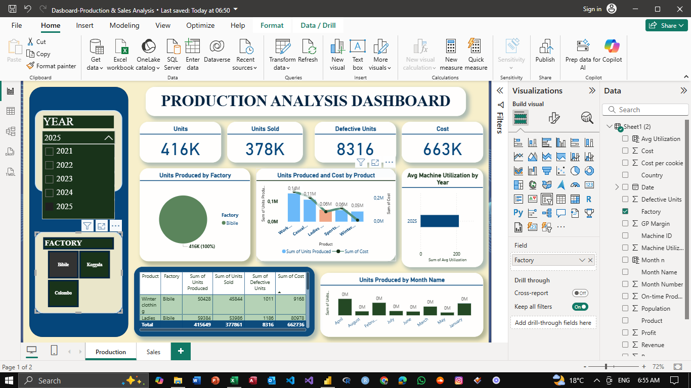
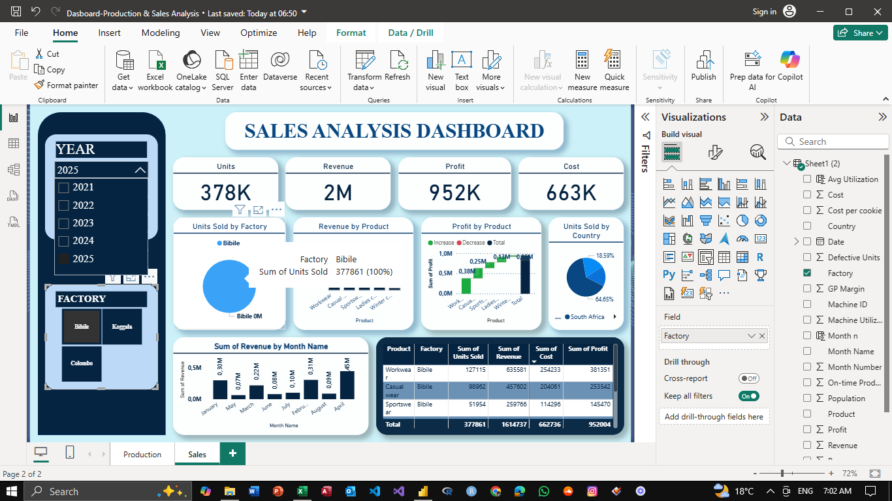
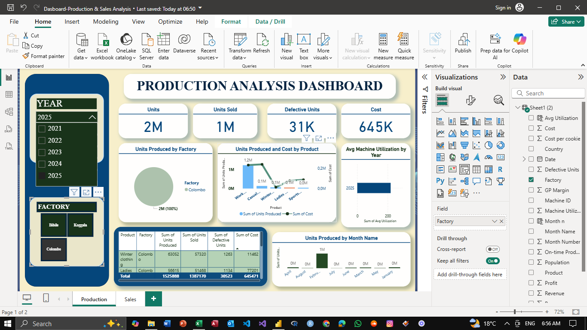
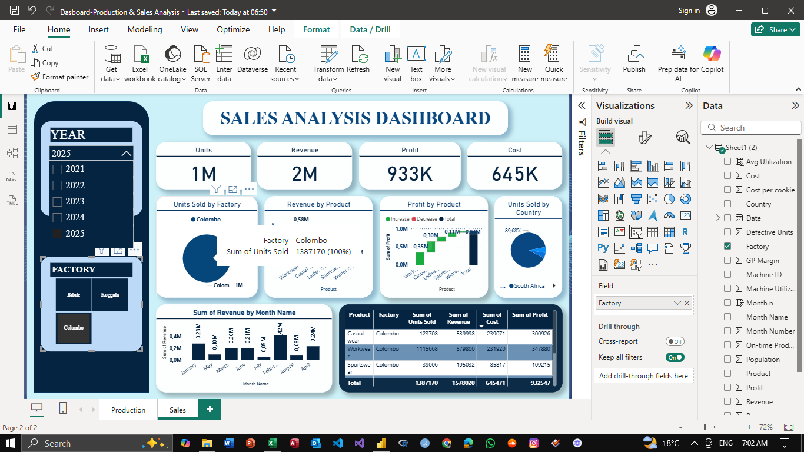

# Production and Sales Analysis Dashboard

### Overview
This dashboard provides insights into production and sales metrics for factories, including units produced, units sold, defective units, and associated costs. Data is visualized for the year 2025, with breakdowns by factory, product, and month.

### Features
- *Factory Selection*: View data for specific factories.
- *Product Breakdown*: Analyze units produced, sold, defective units, and costs by product.
- *Monthly Trends*: Check production patterns by month.

### Key Metrics
- *Units Produced*: 2M for 2025
- *Units Sold*: 1M for 2025
- *Defective Units*: 31K for 2025
- *Cost*: 645K for 2025

### Usage
1. Select a year using the YEAR filter.
2. Choose a factory from the FACTORY section.
3. Analyze metrics and visualizations for insights into production and sales performance.

### Requirements
- Microsoft Excel or compatible software and PowerBI
